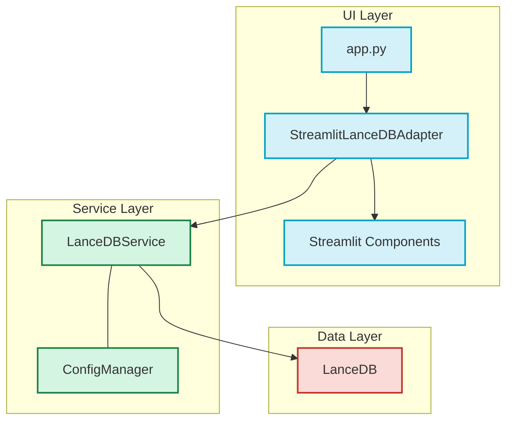

# LanceDB Browser Architecture

The LanceDB Browser application uses a clean architecture pattern to separate UI concerns from business logic. This makes it possible to swap out the UI framework without changing the core functionality.

## Architecture Diagram

## Component Responsibilities

### UI Layer
- **app.py**: The entry point for the Streamlit application
- **StreamlitLanceDBAdapter**: Adapts the core service to the Streamlit UI framework
- **Streamlit Components**: UI-specific components built with Streamlit

### Service Layer
- **LanceDBService**: Core business logic for interacting with LanceDB
- **ConfigManager**: Manages application configuration

### Data Layer
- **LanceDB**: The actual database engine

## Extending with New UI Frameworks

To support a new UI framework:
1. Create a new adapter class in the `adapters` package
2. The adapter should use `LanceDBService` for all database operations
3. Implement UI-specific logic in the new adapter
4. Create a new entry point for the framework